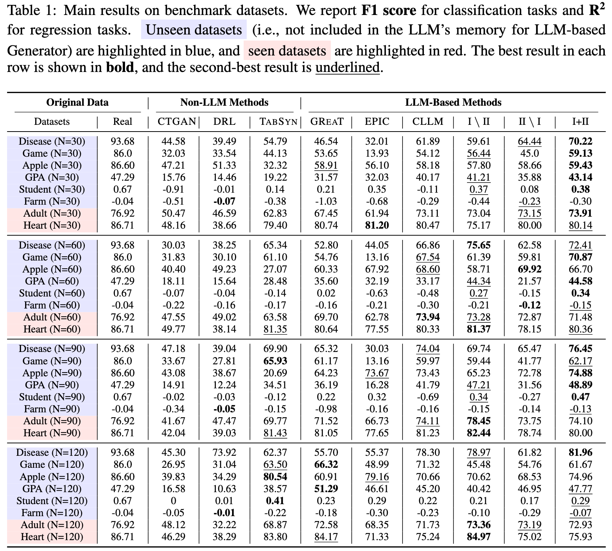

# 🚀 ReFine
Official implementation of "LIMITED REFERENCE, RELIABLE GENERATION: A TWO-COMPONENT FRAMEWORK FOR TABULAR DATA GENERATION IN LOW-DATA REGIMES"


## 🌟 Main Contributions

:one: We identify two key challenges of LLM in tabular data generation in low-data regimes: (i) distributional drift of the synthetic data; and (ii) localized redundancy in the synthetic data. 

:two: To address the two challenges, we propose ReFine1, a framework that constructs association rules to guide tabular data generation, and applies proxy-based distribution estimation with dual-granularity curation to correct localized redundancy.

:three: Experimental results demonstrate that ReFine consistently outperforms strong baselines, achieving up to 0.44 absolute gain in R2 for regression and 10% relative improvement in F1 for classification. Comprehensive ablations further highlight the respective contributions of Rules-Guided Generation and Dual-Granularity Filtering components.

---

## 📂 Run the Code

### :one: Rule Extraction & Generation
Extract & generate rules.

```bash
python rf_llm.py --k 3 --input_file ./data/sampled_30.csv --output_file ./outputs/llm_generated_rules.jsonl
```
You can try with your own data by specifying the `--input_file` argument, and the number of best decision trees by `--k`.

### :two: Rule Denoising
Denoise rules generated in Step 1.

```bash
python consistency.py --input_file ./outputs/rule_set_samples.jsonl --output_file ./outputs/consistency_result.jsonl
```
Notice that we manually collect rule sets generated by step 3 in :one: to assure unified format. We provide 5 sampled rule sets in `./outputs/rule_set_samples.jsonl`.

### :three: Tabular Data Generation
Use merged rule in Step 2 to guide LLM to generate data.

```bash
python llm_generation.py --input_file ./data/sampled_30.csv --output_file ./data/disease_n_30.csv --consistency_rules_file ./outputs/consistency_result.jsonl
```

## 📊 Results



## 📜 License

This project is licensed under the MIT License - see the [LICENSE](LICENSE) file for details.

---

## Citations

